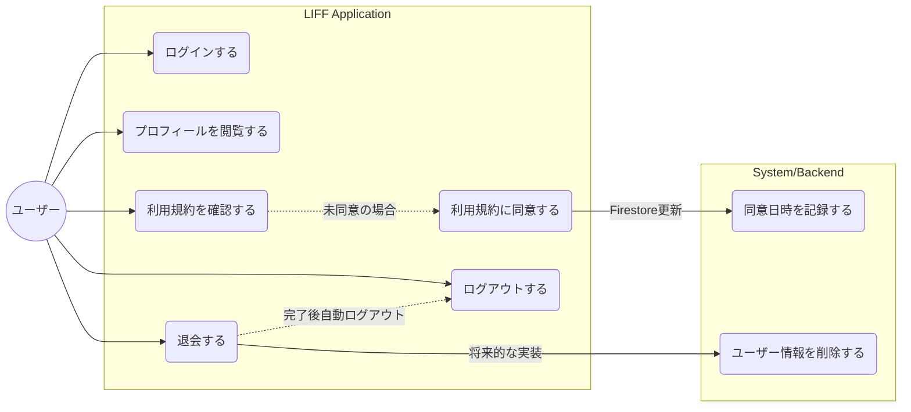

# 02. ユースケース図

## ユースケース記述

| ID | ユースケース名 | 概要 |
| :--- | :--- | :--- |
| UC1 | ログインする | LINEアカウントを使用してアプリにログインする。 |
| UC2 | プロフィールを閲覧する | 自身のアイコン、名前、ID等を確認する。 |
| UC3 | 利用規約を確認する | アプリの利用規約を閲覧する。 |
| UC4 | 利用規約に同意する | 規約に同意し、そのステータスをシステムに保存する。 |
| UC5 | ログアウトする | アプリからログアウトし、セッションを終了する。 |
| UC6 | 退会する | サービスの利用を停止し、退会処理（ログアウト含む）を行う。 |
